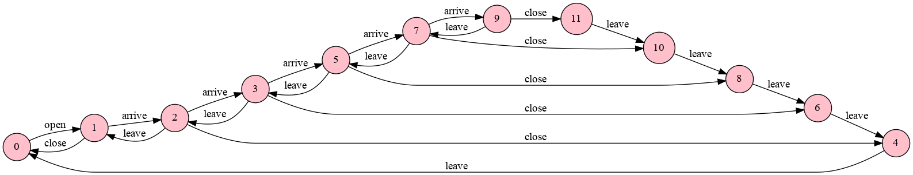
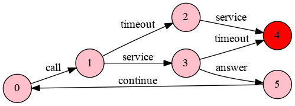
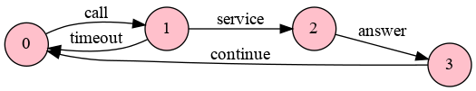

## Lab 1 Labelled Transition System Analyzer & Finite State Processes

Rodrigo Arias Mallo - <rodrigo.arias@est.fib.upc.edu>

### Exercise 1

(M&K 3.6) A museum allows visitors to enter through the east entrance and
leave through its west exit. Arrivals and departures are signaled to the museum
controller by the turnstiles at the entrance and exit. At opening time, the
museum director signals the controller that the museum is open and then the
controller permits both arrivals and departures. At closing time, the director
signals that the museum is closed, at which point only departures are permitted
by the controller. Given that it consists of the four processes EAST, WEST,
CONTROL and DIRECTOR , provide an FSP description for each of the processes and
the overall composition.

	const N = 5
	EAST = (arrive -> EAST).
	WEST = (leave-> WEST).
	DIRECTOR = (open -> close -> DIRECTOR).
	CONTROL= CLOSED[0],
	CLOSED[...] = (when (i==0) open -> OPENED[...]
		|when (...) leave -> CLOSED[...]
		),
	OPENED[i:0..N] = (close -> CLOSED[i]
		|... arrive -> OPENED[...]
		|... leave-> OPENED[...]
	).
	||MUSEUM = (EAST || WEST || DIRECTOR || CONTROL).

The solution has been proposed [here](1/model.fsp). The model can be checked by
inspecting the graph of the proccess `MUSEUM`.

### Exercise 2

(Time-Out Client Server) Consider the following client behavior in a client-server system:

	CLIENT = (call -> WAIT),
	WAIT = (answer -> continue -> CLIENT | timeout -> CLIENT).

In words, the client, after calling the server, can give up obtaining an answer from the
server by issuing a timeout action. This means that the client gets bored waiting the
server answer (the server may be working slowly because it is overloaded), aborts throwing
a timeout and tries later. Assume the following naive server behavior:

	SERVER = (request -> service -> reply -> SERVER).

Solve the following questions:

a) Define the `CLIENT_SERVER` process by composing `CLIENT` and `SERVER` synchronizing
actions `call/request` and `answer/reply`.

	||CLIENT_SERVER = (CLIENT || SERVER) /{.../..., .../...}.

In order to execute the parallel composition || in ltsa you need to press the ||
button next to the C button.

The model is defined [here](2/model.fsp).

b) Draw the `LTS` for `CLIENT_SERVER`. Do you observe in the diagram something strange
pointing out a possible bad behavior in the `CLIENT_SERVER` system?

The resulting graph:

There is a node without exiting edges, so there is a deadlock. In the graph is
marked with a red color. To find out the trace which produced the deadlock, the
file [deadlock.txt](2/deadlock.txt) contains the shortest path:

	Deadlock found for process CLIENT_SERVER: state 4
		Trace to Deadlock: call->timeout->service->

c) Provide a new `SERVER` definition to overcome previous drawbacks.

The new definition can be found [here](2c/model.fsp). Now the graph shows no
deadlocks and the file [deadlock.txt](2c/deadlock.txt) is now empty.

